# The Periodic Table Quiz

# Introduction

The Periodic Table Quiz, is a quiz Periodic Table consists of 15 qustions. Each one with 4 answer options. The user choose one option of these answers and it will be displayed to user if the answer is correct or not with more details on correcr answer. At the end of the quiz, user will get the total score out of 15 and asked to coninue or exit. 

[Live Project Here](https://portfolio-proj3.herokuapp.com/)

## CONTENTS

* [Introduction](#introduction)
* [User Experience UX](#user-experience---UX)
* [Design](#Design)
    * [Colours](#Colours)
* [Logic](#logic)
     * [Flowcharts](#flowcharts)

* [Game Features](#Game-Features)
    * [Introduction Message](#Introroduction-Message) 
    * [Ask Player Name](#Ask-Player-Name)
    * [Empty Input for Name](#Empty-Input-for-Name)
    * [Welcome Message](#Welcome-Message)
    * [Quiz Questions](#Quiz-Questions) 
    * [Correct Answer](#Correct-Answer)
    * [Incorrect Answer](#Incorrect-Answer)
    * [Invalid Data](#Invalid-Data)
    * [Final Score](#Final-Score)
    * [Play Again](#Play-Again)
* [Testing](#testing)
    * [PEP 8 Online](#PEP-8-Online)
    * [Lighthouse](#Lighthouse)
    * [Full Testing](#full-festing)
    * [Bugs](#Bugs)
* [Deployment](#deployment)
    * [Forking this Project](#forking-this-project)
    * [Cloning this Project](#cloning-this-project)
* [Credits](#credits)
    * [Contents](#contents)
    * [Information Sources / Resources](#Information-Sources-Resources)
* [Acknowledgements](#Acknowledgements)

## User Experience - UX

### User Stories

* As the site owner, I want:
  
1. Build an easy application for the users.
2. Users be able to feel both challenging and enjoyable while playing.

   
* As a first time user, I want to:

1. Be able to understand the purpose of the App.
2. Be able to get the score, see the correct and incorrect answers.
3. Be able to play again and improve my score

[Back to top](<#contents>)

## Design

### Colours
* The colours in the game are supplied by the Python Colorama Model

### Flowcharts 
This is the flowchart diagram for the quiz that represent the game process step by step. The charts were generated using [Lucidchart](https://lucid.app/)  
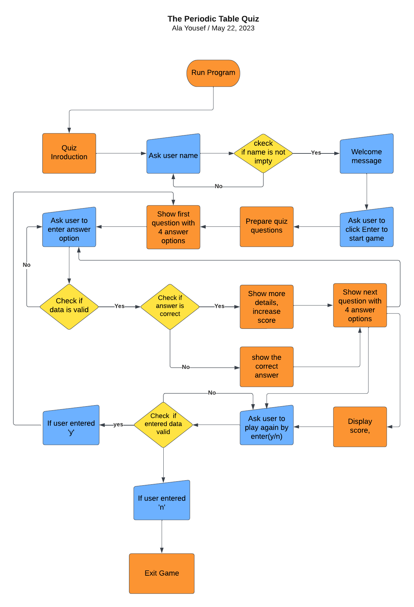 

[Back to top](<#contents>)

## Game Features

### Introduction Message

* When the users open the website, introduction message with quiz details are displayed here. 

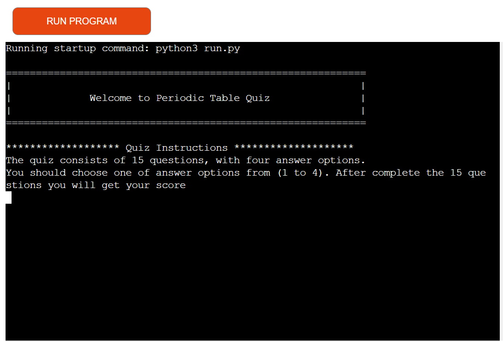

[Back to top](<#contents>)

### Ask Player Name
* After the player sees the introduction message for a few seconds, the user will be asked to input his name. 

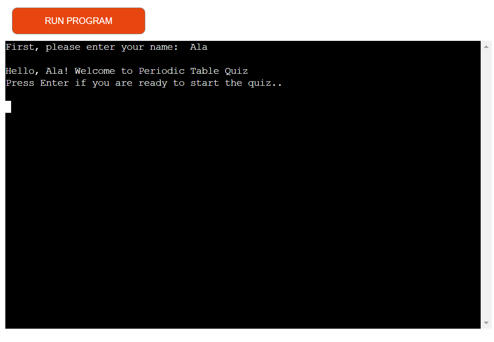

[Back to top](<#contents>)

#### Empty Input for Name
* If the player does not input their name and city, this alert will appear. 

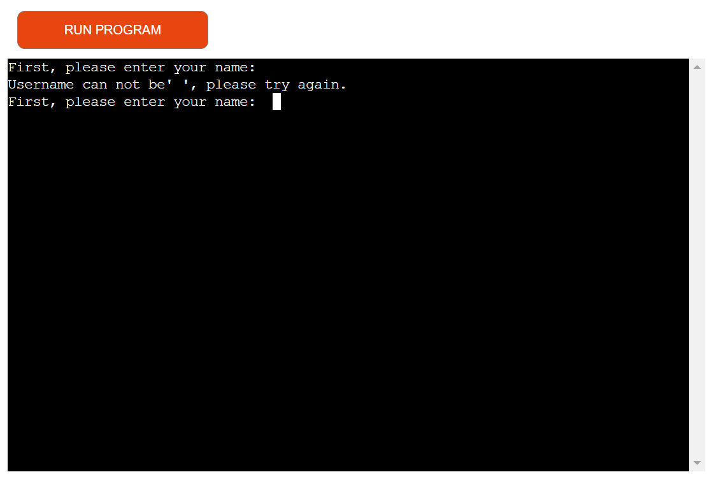

[Back to top](<#contents>)

#### Welcome Message
 * After the player enters their desired username, a short welcome message is displayed and the user asked to press Enter key to start the quiz. 

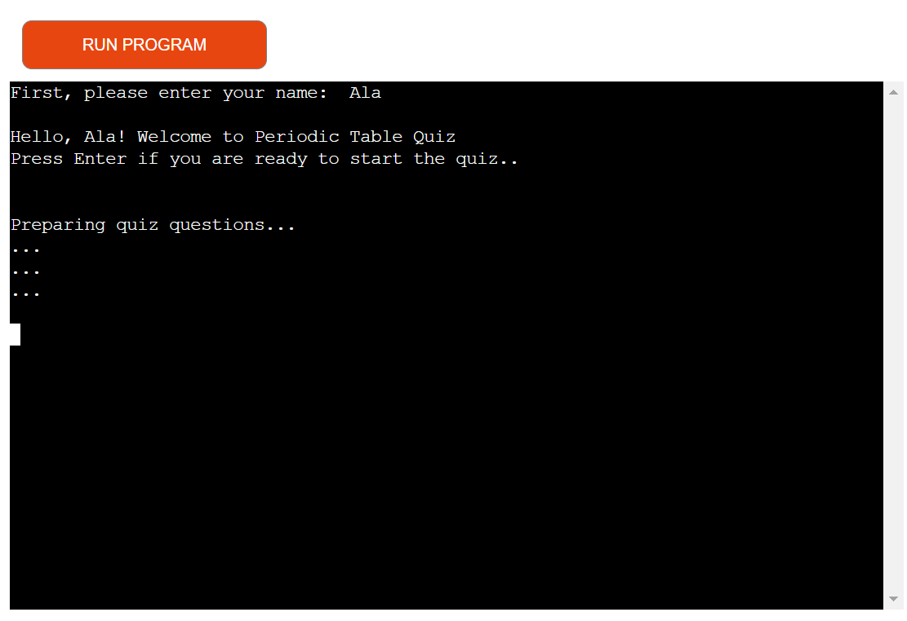

[Back to top](<#contents>)

#### Quiz Questions

 * Then player is presented with the first quiz question.

 * Each question appear with 4 possible answers. Only one is correct.

 * Instructions to enter a number between 1-4 is displayed. This allows the user to answer the quiz question via choosing one of these digits: '1', '2', '3', or '4'.

 * This will repeate until the 15th question is answered.

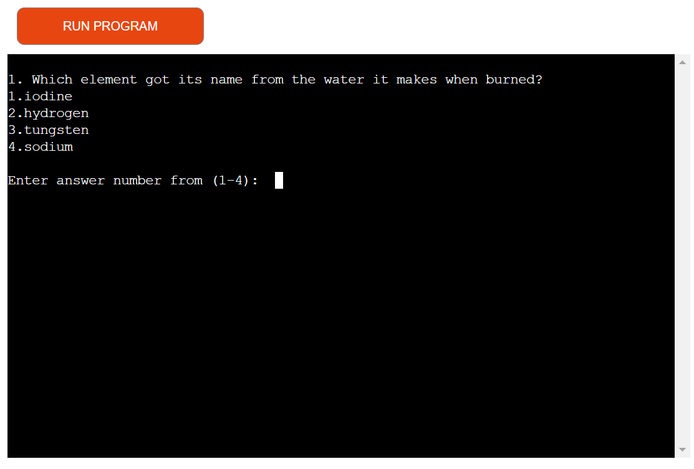  

[Back to top](<#contents>)

#### Correct Answer

 * If the player answers the quiz question correctly, a simple message with: "Good! Your answer is correct :) ⭐" and more details about this question will be displayed.

 * The players score will increase by 1 at the same time a correct answer is guessed. 

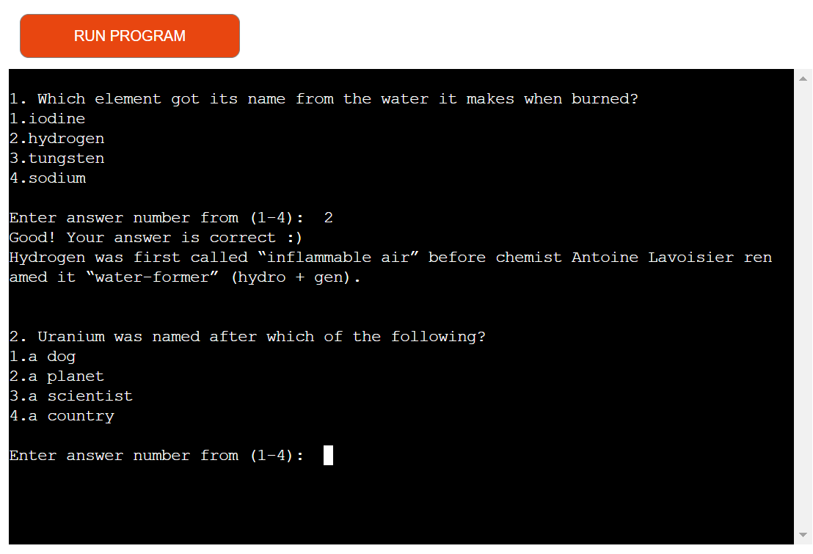 

[Back to top](<#contents>)

#### Incorrect Answer

 * If the player answers the quiz question incorrectly, a simple message with: "Your answer is incorrect :(. The correct answer is {correct_answer}."

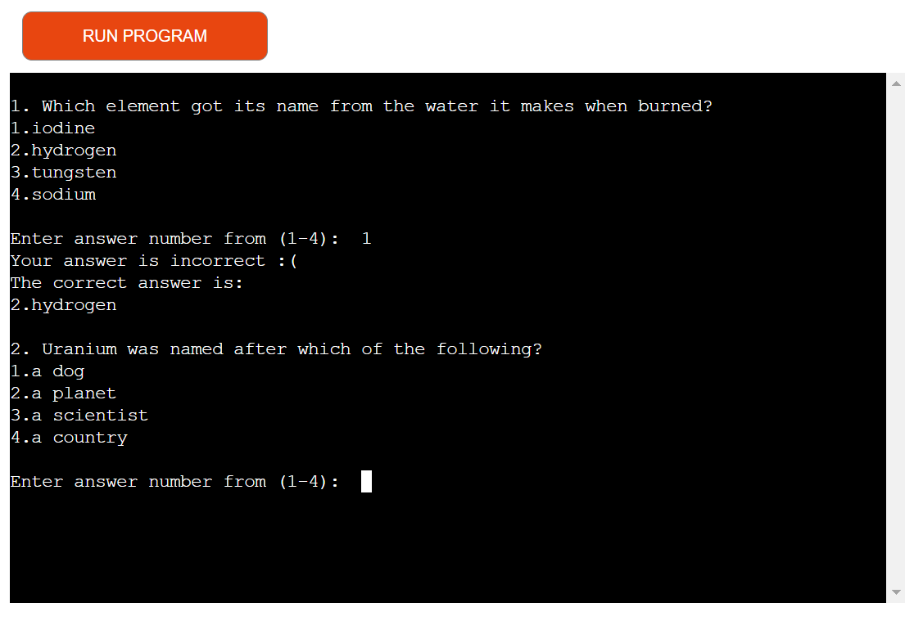 

[Back to top](<#contents>)

#### Invalid Data

 * If the player enter any data rather than '1','2','3' and '4', a message with: "Invalid data: please try again"

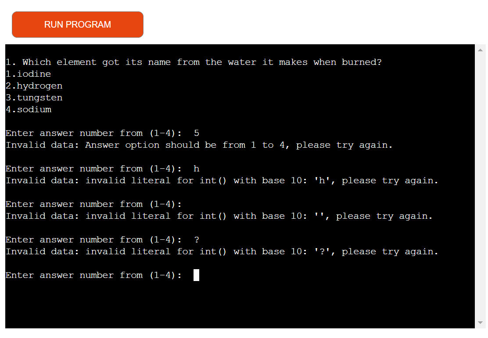 

[Back to top](<#contents>)

#### Final Score
 * If the user finish the quiz, the final score out of 15 will be shown. And a "⭐⭐congratulations⭐⭐" message will be displyed if the total scores were equal or more than 13.

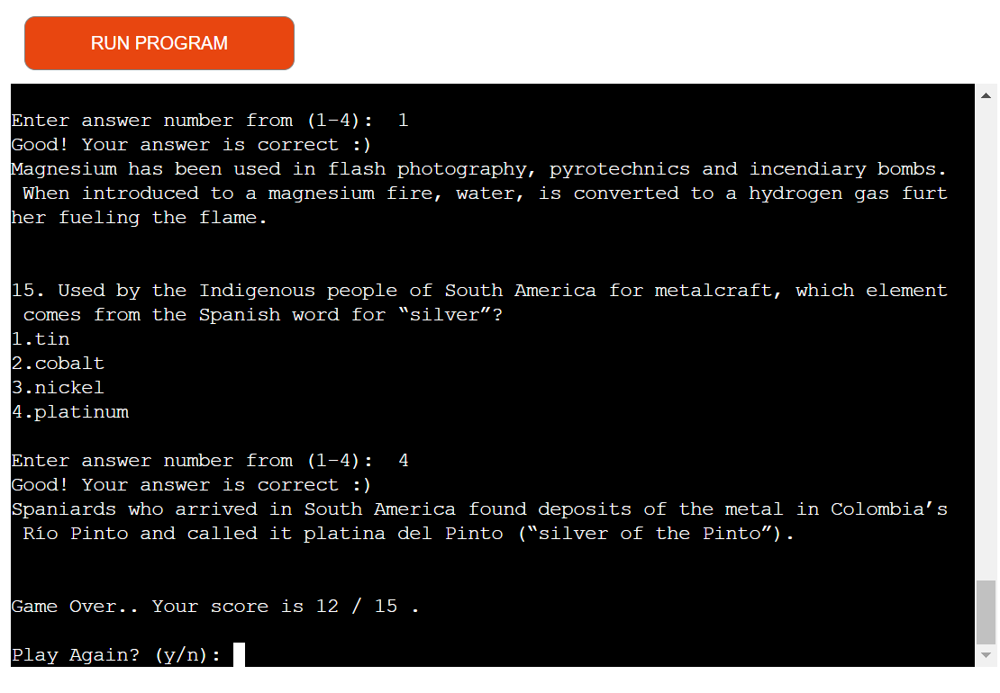 

[Back to top](<#contents>)

#### Play Again

 * After the user answered all 15 questions and get the score, he will asked to play again by enter 'y' for yes or 'n' for no.

 * If the user enter anything rather than 'y' or 'n', this message will be displayed: "Invalid input: please enter 'y' to continue or 'n' to  exit.".

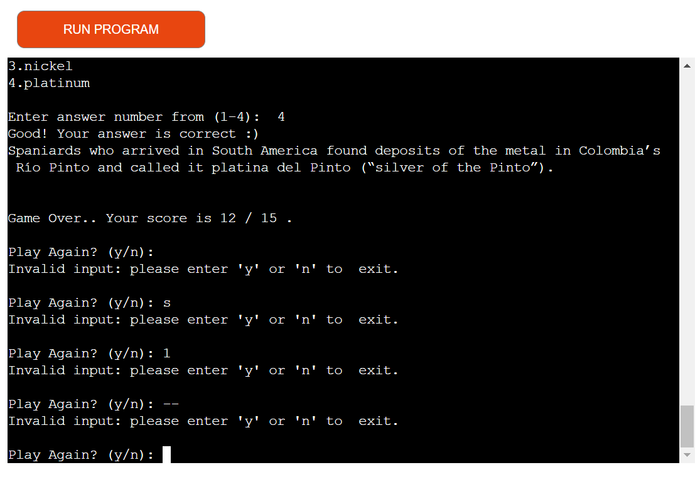 

[Back to top](<#contents>)

* If the user enter 'y', The quiz questions will start again.

* If the user enter 'n', The quiz ends and a message with: "Thanks for you time:)" will be displayed.

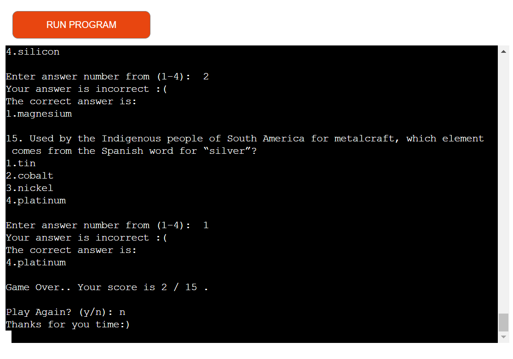 

[Back to top](<#contents>)

## Testing

### PEP 8 Online

The [PEP8](http://pep8online.com/) Validator Service was used to validate the Python file in the project to ensure there is no syntax errors in the project.

* No errors or warnings were found during the testing of the code in PEP8

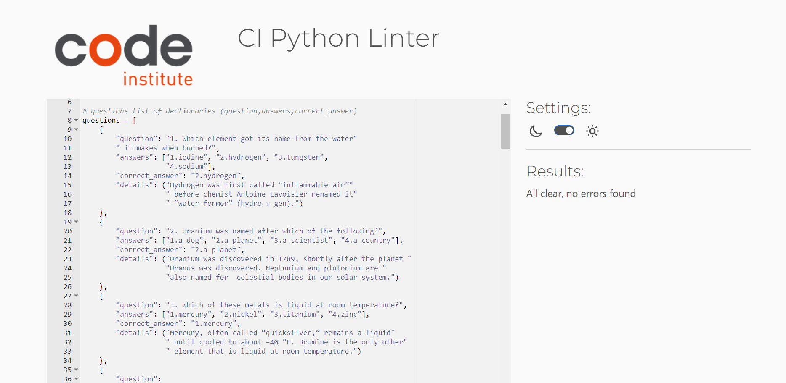 

[Back to top](<#contents>)

### Lighthouse 

* Lighthouse was used to test Performance, Best Practices, Accessibility and SEO on the Desktop.

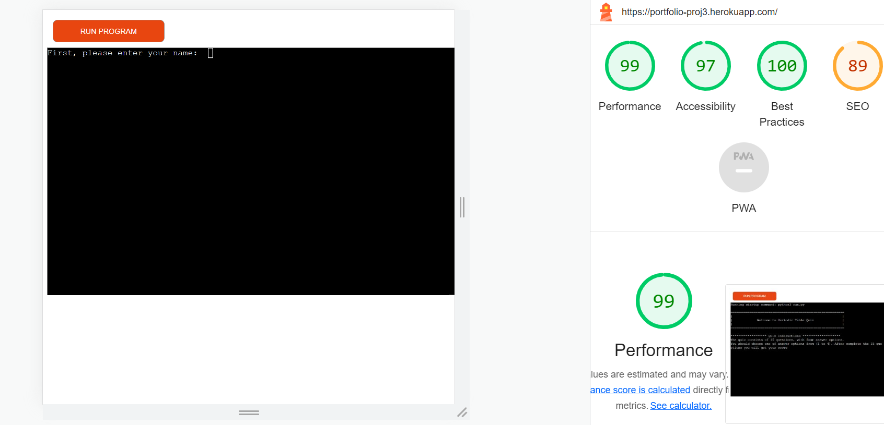 

[Back to top](<#contents>)

### Full Testing 

| Test     | Expected  Outcome   | Pass/Fail    | 
| :----     |    :----   |  :---- | 
| Run run.py | Loads run.py, username prompt appears | Pass |
| Insert username | Welcome message with entered username will displayed | Pass |
| Press Enter without insert name | Try again message will displayed | Pass |
| Press Enter to start | Prepering quiz messaege will appear, Page Clear function executes and the first question will displayed | Pass |
| Enter answer in digits (1-4) + Enter | Loads correct/incorrect Output and provides correct answer, loads next question | Pass |
| Press Enter With No Input/ Enter any other didgits | Invalid data message will be displayed, prompts user to try again and enter digits 1-4 | pass |
| Press Enter on Final Quiz question | Loads Final Score Output, Loads Game Over message and Try Again option | Pass |
| User gets score >= 13 | A congratulations message will displayed with the final score result score/15 | Pass |
| Press Enter or any enteries rather than 'y'/'n' | Loads Invalid Data message, prompts the user to try again and enter 'y' or 'n'. | Pass |
| Press Y on Try Again prompt |  Clears the page and runs quiz again, scores counter return back to 0 | Pass |
| Press N on Try Again Prompt | Loads Thankfull message to player, system exit command executed | Pass |

[Back to top](<#contents>)

## Bugs 
### Resolved

* Through testing, I had indentation warnings which fixed direct.
* Infinit loop occurred after adding exception part on play again function when the user enter anything rather than 'y' or 'n'. It was fixed by adding a 'break' statement at the end of IF statement on try block.

## Deployment

* This site was deployed by completing the following steps:

1. Log in to [Heroku](https://id.heroku.com) or create an account
2. On the main page click the button labelled New in the top right corner and from the drop-down menu select Create New App
3. You must enter a unique app name
4. Next select your region
5. Click on the Create App button
6. The next page is the project’s Deploy Tab. Click on the Settings Tab and scroll down to Config Vars
7. Click Reveal Config Vars and enter POSRT into the Key box and 8000 into the Value box and click the Add button
8. If there are credentiels click Reveal Config Vars again and enter CREDS into the Key box and the Google credentials into the Value box
9. Next, scroll down to the Buildpack section click Add Buildpack select python and click Save Changes
10. Repeat step 8 to add node.js. o Note: The Buildpacks must be in the correct order. If not click and drag them to move into the correct order
11. Scroll to the top of the page and choose the Deploy tab
12. Select Github as the deployment method
13. Confirm you want to connect to GitHub
14. Search for the repository name and click the connect button
15. Scroll to the bottom of the deploy page and select the preferred deployment type
16. Click Enable Automatic Deploys for automatic deployment when you push updates to Github

## Forking This Project

* Fork this project by following the steps:

1. Open [GitHub](https://github.com/)
2. Click on the project to be forked
3. Find the Fork button at the top right of the page
4. Once you click the button the fork will be in your repository

## Cloning This Project

* Clone this project by following the steps:
  
1. Open [GitHub](https://github.com/)
2. Click on the project to be cloned
3. You will be provided with three options to choose from, HTTPS, SSH, or GitHub CLI, click the clipboard icon in order to copy the URL
4. Once you click the button the fork will be in your repository
5. Open a new terminal
6. Change the current working directory to the location that you want the cloned directory
7. Type git clone and paste the URL copied in step 3
8. Press Enter and the project is cloned

[Back to top](<#contents>)

## Credits

### Content

* All quiz questions have been taken from [Britannica](https://www.britannica.com/quiz/facts-you-should-know-the-periodic-table-quiz).

* The Python code functionality help is from the following: [Real Python Tutorials](https://realpython.com/python-quiz-application/#step-1-ask-questions) and from this repository [GitHub](https://github.com/KrystalCoding/plant-quiz/blob/main/README.md).

* Indentation warnings were solved by helping from [Flake8rules](https://www.flake8rules.com/).

* Readme file following template is from these repositories on GitHub : [plant-quiz](https://github.com/KrystalCoding/plant-quiz/blob/main/README.md) and [portfolio_project_3](https://github.com/PedroCristo/portfolio_project_3#Ask-Player-Name-and-City). 

### Information Sources / Resources

* [Code Institute](https://learn.codeinstitute.net/dashboard)
* [W3Schools - Python](https://www.w3schools.com/python/)
* [Stack Overflow](https://stackoverflow.com/)

[Back to top](<#contents>)

## Acknowledgements
This App was completed as a Portfolio Project 3 for the Full Stack Software Developer Diploma at the [Code Institute](https://codeinstitute.net/). I would like to thank my mentor [Precious Ijege](https://www.linkedin.com/in/precious-ijege-908a00168/), the Slack community, tutor support. And all at the Code Institute for their help.

[Back to top](<#contents>)

